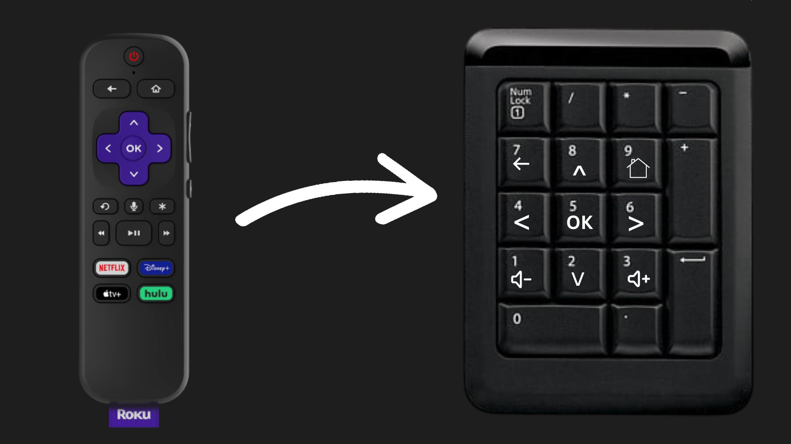

# Numpad Roku Remote
Control a Roku Tv with your PC's numpad.
This is a super simple script using [Python Roku](https://github.com/jcarbaugh/python-roku) that does exactly what it says.

Controlls:

